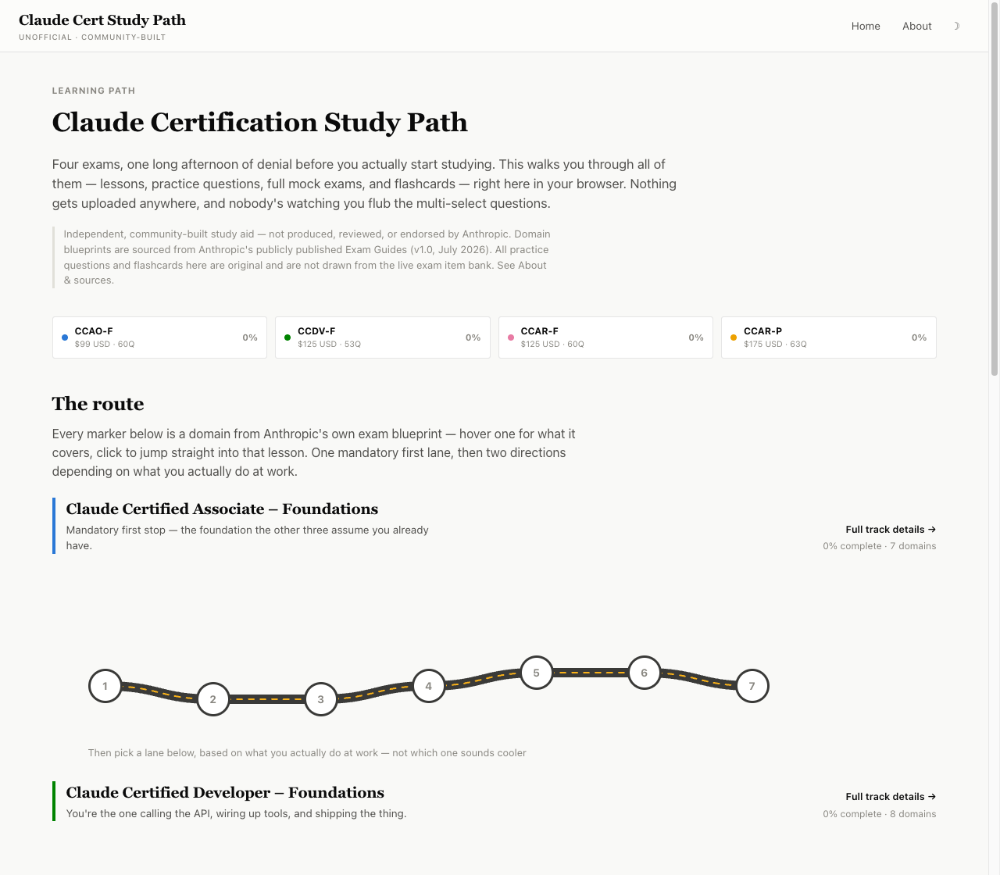

# Claude Certification Study Path

An interactive, local-first study companion for Anthropic's four **Claude Certification** exams. No build step, no account, no server — clone it and open `index.html`.

**⚠️ Unofficial.** This project is not produced, reviewed, or endorsed by Anthropic. See [Sources & disclaimer](#sources--disclaimer) below.



## What's inside

All four certifications, following the exact domain blueprint Anthropic publishes in its Exam Guides — including each domain's real exam weighting, which is also how depth is allocated here (a 33%-weight domain gets far more material than a 3% one).

| Track | Code | Cost | Exam | Domains | Lessons | Practice Qs | Flashcards |
|---|---|---|---|---|---|---|---|
| Claude Certified Associate – Foundations | CCAO-F | $99 | 60 Q / 120 min | 7 | 34 | 99 | 85 |
| Claude Certified Developer – Foundations | CCDV-F | $125 | 53 Q / 120 min | 8 | 42 | 104 | 92 |
| Claude Certified Architect – Foundations | CCAR-F | $125 | 60 Q / 120 min | 5 | 29 | 99 | 92 |
| Claude Certified Architect – Professional | CCAR-P | $175 | 63 Q / 120 min | 7 | 37 | 101 | 102 |

**Totals: 142 lesson pages · 62 interactive exercises · 403 practice questions · 371 flashcards.**

For every domain you get:

- **A walkthrough, one concept per page** — each with a worked example and a named failure mode, not just an assertion. Analogy callouts for the concepts that don't land cold, and side-by-side wrong/right comparisons where the difference is the lesson.
- **Interactive exercises** — four kinds, used where they genuinely fit:
  - *Step-through* — walk a process one turn at a time (e.g. an agentic loop, watching `stop_reason` flip and the transcript accumulate).
  - *Scenario* — make a branching decision, then find out whether you hit the failure mode.
  - *Classify* — sort items into buckets ("hook or prompt?", "which layer failed?") with per-item feedback.
  - *Sequence* — put steps in the correct order (a RAG pipeline, a discovery lifecycle).
- **Checkpoints** at the end of each walkthrough, then **a domain quiz** — scenario-framed, single- and multi-select, in the real exam's format.
- **A timed full practice exam per track** — drawn to the real item count with the real 120-minute clock, a domain-by-domain score breakdown, and a **review of every question you missed** with what you picked and why the right answer is right.
- **Flashcards** — with a know-it/still-learning flow so mastered cards drop out of rotation. Keyboard: <kbd>space</kbd> flip, <kbd>→</kbd> know it, <kbd>←</kbd> still learning.

Progress (lessons read, best quiz scores, flashcard mastery) is saved to your browser's `localStorage`, scoped per track and per domain. Nothing is sent anywhere — there's no backend at all. You can wipe it any time from the About page.

## Running it locally

No dependencies, no build. Either:

```bash
# open the file directly
open index.html

# or serve it (needed if your browser restricts localStorage/fetch under file://)
python3 -m http.server 8000
# then visit http://localhost:8000
```

## Project structure

```
index.html               shell page — loads data + app.js
css/style.css            design system + layout (light/dark, theme-aware)
js/app.js                hash router, lesson/quiz/flashcard/widget rendering, localStorage progress
js/data/associate.js               content for Claude Certified Associate – Foundations
js/data/developer.js               content for Claude Certified Developer – Foundations
js/data/architect-foundations.js   content for Claude Certified Architect – Foundations
js/data/architect-professional.js  content for Claude Certified Architect – Professional
CONTENT_GUIDE.md         the authoring contract — schema, widget types, quality bar
```

Each `js/data/*.js` file registers itself into a shared `window.CERT_DATA` object — that's the entire "database." All content, including every interactive exercise, is plain data; the engine renders it. Adding or correcting content means editing one of those files and nothing else.

**If you're contributing content, read [CONTENT_GUIDE.md](CONTENT_GUIDE.md) first** — it documents the object schema, all four interactive widget types with their data shapes, the content primitives, and the quality bar.

## Sources & disclaimer

Domain blueprints, weightings, task statements, and exam mechanics (format, cost, passing score, retake policy) are sourced from **Anthropic's official Exam Guide PDFs (Version 1.0, effective July 2026)** for each of the four certifications, published via the Anthropic Partner Academy, plus Pearson VUE's public program page.

All lesson content, practice questions, and flashcards in this repository are **original** — written to teach the published blueprint objectives, not drawn from or reproducing any live exam item bank. (Doing so would violate the confidentiality agreement every candidate accepts before sitting the real exam.) 21 quiz items are tagged `source: "official"` in the data files — these are the illustrative sample questions Anthropic itself publishes in each Exam Guide for candidate preparation, reproduced with their published answer and rationale.

Nothing here is copied from other people's practice banks either. Most community and commercial question banks are either unlicensed (default copyright, all rights reserved) or explicitly proprietary, so they can't be lawfully redistributed under this repo's MIT license — and anything advertising *real* exam questions is a braindump, which this project won't touch on principle.

This project does not register candidates, proctor exams, or issue credentials. To sit a real exam, go through the Anthropic Partner Academy and schedule via Pearson VUE.

If you're studying for the real thing and notice something here that's outdated or wrong relative to the current official Exam Guide, please open an issue or PR — Anthropic updates these blueprints over time and this content should track them.

## Contributing

PRs welcome — corrections to existing content, new practice questions, additional flashcards, new interactive exercises, or accessibility/UX improvements.

Read [CONTENT_GUIDE.md](CONTENT_GUIDE.md) for the schema and quality bar, keep content changes inside `js/data/*.js`, and before submitting run:

```bash
node --check js/data/<file>.js   # syntax
node tools/validate.js           # schema + integrity across all tracks
```

The validator is worth running even for a one-line change: it catches the failure modes that are invisible on the page, like a classify item whose answer isn't among its own options (silently unanswerable), an out-of-range correct index, or a duplicated question stem.

## License

MIT — see [LICENSE](LICENSE).
